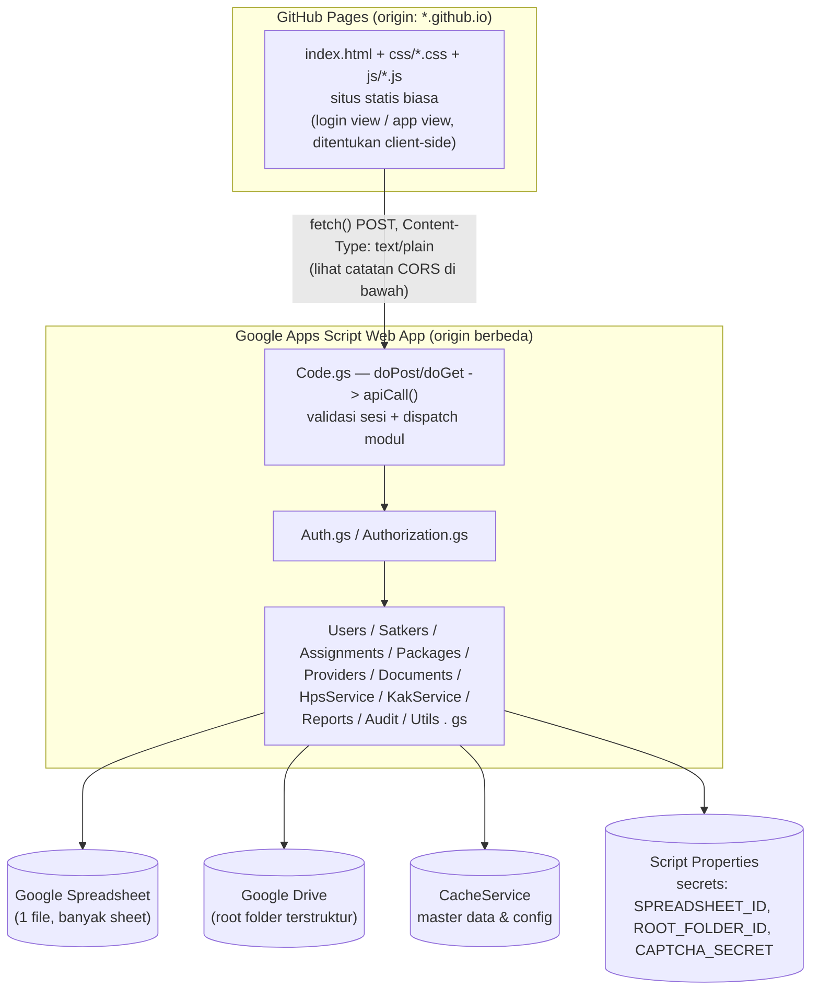
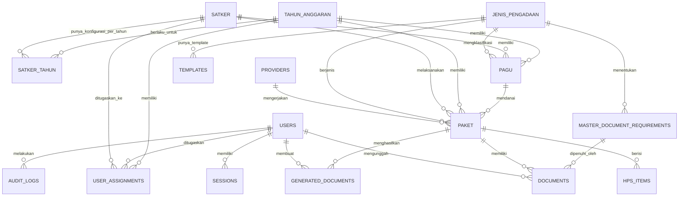

# Desain Sistem Informasi Pengadaan Barang/Jasa Internal
### Kementerian Agama Kabupaten Indramayu

**Status dokumen:** Keempat Keputusan di bawah sudah difinalkan oleh Ponari (lihat penanda **[DIPILIH]** di tiap Keputusan). Implementasi Tahap 1 (Fondasi: Auth + DB + Satker + Assignment) sudah dieksekusi berdasarkan pilihan ini. **Arsitektur diubah sekali lagi** (lihat Bagian A & L, ditandai **[DIUBAH]**): frontend dipisah untuk di-deploy ke GitHub Pages, Apps Script sekarang murni backend/API — kode lengkapnya dikirim terpisah sebagai `pengadaan-tahap1-github-pages.zip` (menggantikan `pengadaan-tahap1.zip` versi sebelumnya).

**Cara membaca:** Bagian A–O di bawah mengikuti persis daftar yang Anda minta. Sebelum itu, ada 4 keputusan yang saya rekomendasikan Anda tentukan lebih dulu karena dampaknya menjalar ke banyak bagian — tapi seluruh dokumen tetap saya susun lengkap dengan asumsi default yang jelas ditandai, supaya tidak ada yang menunggu keputusan Anda.

---

## Keputusan yang Perlu Anda Tentukan

### Keputusan 1 — Model Autentikasi
*(Ini sekaligus jawaban untuk permintaan Anda: "jelaskan trade-off keamanan Apps Script")*

**Opsi A — Login dengan akun Google** (memanfaatkan akun Google yang sudah dipakai 8 ASN untuk Sheets/Drive selama ini)
- Web App di-deploy dengan *Execute as: User accessing the web app*, akses dibatasi ke daftar email tertentu. Backend cukup memanggil `Session.getActiveUser().getEmail()`, dicocokkan ke sheet USERS. Google yang menangani password, 2FA, deteksi login mencurigakan — tidak ada password/session/CAPTCHA custom yang perlu dibangun.
- **Trade-off nyata** (saya cek ke dokumentasi resmi Apps Script sebelum menulis ini): karena script berjalan atas nama masing-masing user, kedelapan ASN perlu diberi akses Editor langsung ke Spreadsheet & folder Drive sumber data. Konsekuensinya, siapa pun dari mereka yang cukup paham bisa membuka Spreadsheet/Drive itu langsung dan melihat data satker yang bukan tanggung jawabnya — melewati pembatasan per-satker di level aplikasi. Ini bukan bug yang bisa ditambal kode; itu konsekuensi dari model "jalankan sebagai user".
- **Jalan tengah bagus** kalau kantor Anda punya domain Google Workspace bersama (bukan akun Gmail pribadi masing-masing): deploy *Execute as: Me* + akses dibatasi ke domain itu. Dokumentasi resmi Google menyatakan pembatasan identitas kosong tadi "generally do not apply" kalau developer dan user satu domain Workspace — artinya `Session.getActiveUser()` tetap dapat identitas asli, SEKALIGUS Spreadsheet/Drive bisa tetap privat milik satu akun. Ini kombinasi paling ideal, tapi hanya berlaku jika domain bersama itu memang ada.

**Opsi B — Login custom** (sesuai permintaan awal Anda: password hash, session, CAPTCHA, lockout)
- Apps Script tidak punya bcrypt/Argon2 bawaan (dijelaskan di Bagian F), jadi ini kerja keamanan yang sepenuhnya Anda tanggung.
- **Kelebihan yang ternyata lebih kuat dari perkiraan awal saya:** karena berjalan *Execute as: Me*, Spreadsheet & Drive folder bisa 100% privat milik satu akun. Kedelapan ASN **tidak pernah** diberi akses Google langsung ke data mentah — satu-satunya pintu masuk adalah lewat aplikasi. Ini isolasi akses yang lebih tegas daripada Opsi A.

**[DIPILIH: Opsi B — Login custom.]** Sesuai rekomendasi, dan sesuai keputusan Anda. Seluruh Bagian F serta kode Tahap 1 mengikuti ini sepenuhnya.

### Keputusan 2 — Mekanisme Generate KAK/HPS
**[DIPILIH: Opsi B — Template HTML** (`template_kak.html`/`template_hps.html`), sesuai gambaran awal Anda, bukan Google Docs.**]**
- Konsekuensi teknis yang perlu disiapkan (karena Apps Script tidak punya konversi HTML→PDF bawaan yang rapi): render HTML placeholder di server jadi string lengkap → tampilkan sebagai pratinjau di halaman (iframe/div) untuk ditinjau PPK → saat "Finalize", konversi ke PDF dilakukan lewat rute yang sebenarnya *masih* memakai Google Docs sebagai perantara teknis di baliknya (bukan di-expose ke Anda sebagai konsep): HTML dirender ke `DocumentApp` via `Xml`/`insertHtml`-style konversi sederhana, lalu `getAs(MimeType.PDF)` — ini akan didetailkan saat Tahap 6 (KAK Generator) dan Tahap 7 (HPS) tiba; belum termasuk kode Tahap 1 ini.
- Bagian H/I di bawah akan diperbarui detailnya saat tahap itu tiba; poin kuncinya sudah dicatat di sini supaya tidak diam-diam kembali ke Opsi A nanti.

### Keputusan 3 — Komponen Grid HPS
**[DIPILIH: Opsi B — library grid ringan via CDN]**, bukan grid native buatan sendiri.
- Rekomendasi library: **jspreadsheet CE** (CE = Community Edition, gratis/open-source, vanilla JS murni — tetap sejalan dengan "tidak pakai framework frontend"), dimuat lewat CDN dengan versi dipin sesuai instruksi Anda soal library pihak ketiga. Ini juga sudah mendukung paste dari Excel secara native lewat plugin-nya, jadi sebagian logika parser `text/html` clipboard di Bagian I bisa memakai fitur bawaan library ini, bukan ditulis dari nol.
- Relevan mulai Tahap 7 (HPS Spreadsheet) — belum termasuk kode Tahap 1 ini.

### Keputusan 4 — CAPTCHA
**[DIPILIH: CAPTCHA buatan sendiri lewat kode — bukan Opsi A (reCAPTCHA), bukan murni Opsi B (honeypot).]** Anda secara spesifik minta CAPTCHA sungguhan (kotak visual yang harus dibaca & diketik ulang, sesuai mockup login awal Anda) tapi tanpa bergantung pada site key/secret key Google. Desain yang dipakai di kode Tahap 1:
- Server (`Auth.gs`) membuat 5 karakter acak (huruf+angka, karakter ambigu seperti `0/O/1/I` sengaja dibuang), simpan di `CacheService` terikat ke `challengeId` acak, TTL 5 menit, **sekali pakai** (langsung dihapus begitu dipakai untuk verifikasi, berhasil maupun gagal).
- Klien menggambar teks itu ke `<canvas>` HTML5 dengan distorsi (rotasi acak per huruf, warna acak, garis & titik noise) — murni JavaScript native, tidak ada library atau layanan eksternal apa pun.
- **Kejujuran soal batasannya** (supaya tidak terkesan ini sekuat reCAPTCHA): karena teksnya harus dikirim ke klien agar bisa digambar, penyerang yang membaca isi respons jaringan secara langsung (bukan sekadar screen-scraping tampilan) tetap bisa melihatnya — beda dengan reCAPTCHA yang melakukan scoring risiko di server Google tanpa pernah mengekspos "jawaban". Jadi anggap ini sebagai penghalang untuk bot/script kasar yang asal coba-coba, **bukan** pertahanan utama — pertahanan utama tetap lockout + throttle per-username yang sudah dirancang di Bagian F.

---

## A. System Architecture

**[DIUBAH]** Frontend dan backend sekarang di-host **terpisah** (permintaan Ponari,
supaya frontend bisa di-deploy ke GitHub Pages): HTML/CSS/JS tidak lagi
disajikan oleh Apps Script sama sekali. Ini mengganti pola `google.script.run`
di bawah dengan `fetch()` HTTP biasa.



**Pola komunikasi frontend↔backend — kenapa bukan `google.script.run` lagi.**
`google.script.run` HANYA tersedia kalau HTML-nya disajikan oleh Apps Script
project yang sama (lewat `HtmlService`). Begitu HTML pindah ke GitHub Pages
(origin berbeda), satu-satunya jalan adalah HTTP biasa (`fetch()`) ke URL Web
App Apps Script yang di-deploy sebagai API. Ini mendatangkan masalah CORS
yang genuinely perlu penanganan khusus:

- Apps Script Web App **tidak bisa** menjawab *preflight* `OPTIONS` — tidak
  ada `doOptions()` yang benar-benar berfungsi (keterbatasan platform, sudah
  saya cek ke beberapa sumber komunitas terbaru — bukan sesuatu yang bisa
  ditambal dengan menambahkan header di kode `doPost()`, walau ada beberapa
  artikel yang keliru mengklaim bisa).
- Solusinya: **hindari preflight-nya**, bukan mencoba menjawabnya. Klien
  mengirim POST dengan `Content-Type: text/plain` (isi body tetap teks JSON
  biasa) — ini membuat browser menganggapnya *simple request* yang tidak
  memicu preflight sama sekali. Backend membaca `e.postData.contents` dan
  mem-parsing JSON-nya secara manual.
- Token sesi tetap dikirim eksplisit di body (bukan cookie, sesuai Bagian F)
  — ini kebetulan juga menyelamatkan kita dari masalah CORS lain
  (`credentials:'include'` tidak diperlukan sama sekali).
- **Kejujuran soal batasannya:** pola ini sudah lazim dipakai untuk kasus
  persis begini (frontend eksternal + backend Apps Script) dan terbukti
  bekerja, tapi bukan kontrak resmi yang didokumentasikan Google — jadi
  tetap ada risiko kecil kalau perilaku internalnya berubah di masa depan.

Dispatcher inti **tidak berubah**: `apiCall(module, action, payload,
sessionToken)` di `Code.gs` SELALU memvalidasi token sesi dan otorisasi
*sebelum* memanggil fungsi modul manapun. Yang berubah hanya "pembungkus"-nya
— dulu dipanggil langsung oleh `google.script.run`, sekarang dipanggil oleh
`doPost`/`doGet` setelah mem-parsing request HTTP. **Seluruh modul bisnis
(Auth, Users, Satkers, dst.) sama sekali tidak tahu dan tidak perlu tahu
bagaimana request-nya sampai — pemisahan ini murah justru karena dispatcher
sejak awal didesain terpisah dari transportnya.**

**Isolasi multi-tahun** dilakukan di level data (kolom `tahun_anggaran_id` sebagai partisi), **bukan** dengan Spreadsheet terpisah per tahun — supaya dashboard gabungan lintas-tahun tetap mudah. Folder Drive tetap dipisah per tahun sesuai struktur yang Anda gambarkan.

**Keterbatasan platform Apps Script** (detail lengkap di Bagian O) sekarang HANYA berlaku untuk backend, karena frontend tidak lagi tinggal di dalam batasan file `.gs`/`.html` Apps Script — struktur frontend jadi lebih konvensional, lihat Bagian L.

---

## B. ERD



**Catatan penyesuaian desain** (agar transparan, bukan diam-diam berbeda dari draf awal Anda):
1. **SATKER_TAHUN (baru).** Draf Anda meletakkan `SP_DIPA`, `KPA`, `PPK`, `Pejabat Pengadaan` langsung di tabel SATKER. Karena elemen ini realistis berubah tiap tahun anggaran (DIPA baru terbit tiap tahun, pejabat bisa berganti), saya pisahkan ke tabel `SATKER_TAHUN` supaya data tahun-tahun sebelumnya tidak tertimpa saat ada pergantian. Contoh nyata: dokumen contoh Anda sendiri menyebut "MA Negeri 1 Indramayu Tahun Anggaran **2025**" di Latar Belakang tapi nomor DIPA-nya berakhiran "**/2026**" — persis jenis kerancuan yang dicegah kalau tahun anggaran adalah field eksplisit, bukan sesuatu yang ditebak dari teks. Jika Anda tetap ingin field ini melekat langsung di SATKER (misalnya karena PPK/KPA di kantor Anda jarang berganti), itu tetap bisa — beri tahu saya.
2. **GENERATED_DOCUMENTS (menggantikan/memperluas sheet KAK_DATA).** Saya satukan riwayat versi KAK *dan* HPS ke satu tabel log, alih-alih KAK_DATA terpisah dan mekanisme versi HPS yang tidak eksplisit di draf Anda. Ini mengurangi duplikasi struktur dan membuat pola "snapshot" (dijelaskan di Bagian H) konsisten untuk kedua jenis dokumen.
3. **TEMPLATES (baru).** Karena struktur KAK Pemeliharaan Gedung kemungkinan besar berbeda dari Peralatan & Mesin, saya tambahkan tabel master template yang bisa dikaitkan per jenis pengadaan (opsional — kosong berarti pakai template default).
4. **Pola snapshot untuk dokumen legal.** `PAKET` menyimpan salinan (snapshot) nama PPK/PP/KPA saat paket dibuat — bukan hanya referensi live ke SATKER_TAHUN. Ini supaya saat KAK v2 sudah ditandatangani lalu PPK berganti, sistem tetap tahu persis siapa yang menandatangani v2 (untuk audit), sekaligus bisa mendeteksi "data pejabat sudah berubah sejak generate terakhir → sebaiknya generate ulang" (menjawab prinsip Anda soal deteksi perubahan PPK/pagu).

---

## C. Google Spreadsheet Database Design

Satu file Spreadsheet (`DB_Pengadaan_Kemenag_Indramayu`), setiap tabel = satu sheet/tab. ID Script Spreadsheet disimpan **hanya** di Script Properties, tidak pernah di kode atau frontend.

**Strategi ID:** prefix + nomor berurutan (mis. `SAT-00001`) untuk tabel dengan frekuensi tulis rendah–sedang, dihasilkan lewat `LockService` + sheet tersembunyi `_COUNTERS` (kolom: `entity`, `last_value`) agar atomik tanpa scan seluruh tabel tiap kali. Untuk tabel append-berat (`AUDIT_LOGS`, `SESSIONS`, `NOTIFICATIONS`), pakai `timestamp + random suffix` (mis. `AUD-1757...-x7q2`) — **tanpa** lock, supaya penulisan log yang sering tidak jadi titik kemacetan.

| Sheet | Field | Keterangan |
|---|---|---|
| **CONFIG** | `key, value, description, updated_at, updated_by` | Hanya setting non-rahasia (APP_NAME, SESSION_TIMEOUT, MAX_FILE_SIZE, ALLOWED_MIME_TYPES, DEFAULT_YEAR, dll). Rahasia (Spreadsheet ID, folder ID, secret CAPTCHA) **tidak** di sini — lihat Bagian F. |
| **YEARS** | `tahun_anggaran_id (PK), tahun, status [AKTIF/TUTUP], tanggal_mulai, tanggal_selesai, catatan, created_at, created_by` | |
| **SATKER** | `satker_id (PK), kode_satker, nama_satker, jenis_satker [MAN/MIN/MTsN/KUA/PENDIS/SEKJEN/LAINNYA], wilayah, alamat, status, catatan, created_at, updated_at, created_by, updated_by` | Data timeless satker. Kode disimpan terpisah dari nama sesuai instruksi Anda. |
| **SATKER_TAHUN** *(baru — lihat catatan ERD)* | `satker_tahun_id (PK), satker_id (FK), tahun_anggaran_id (FK), sp_dipa, tanggal_dipa, kpa_nama, kpa_nip, ppk_nama, ppk_nip, pejabat_pengadaan_nama, pejabat_pengadaan_nip, ada_pengadaan [BELUM_DITENTUKAN/ADA/TIDAK_ADA], status, catatan, created_at, updated_at` | `ada_pengadaan` inilah yang membedakan "Tidak Ada Pengadaan" dari "Belum Diinput" — lihat Bagian J. |
| **USERS** | `user_id (PK), nama, nip, email, username, password_hash, password_salt, password_iterations, role [ADMIN/PENGELOLA/VIEWER], status, last_login, failed_login_count, locked_until, created_at, updated_at` | Lihat Bagian F untuk detail hashing. Jika Keputusan 1 = Opsi A, kolom password_* tidak dipakai, cukup `email` sebagai kunci pencocokan. |
| **USER_ASSIGNMENTS** | `assignment_id (PK), tahun_anggaran_id (FK), user_id (FK), satker_id (FK), tanggal_mulai, tanggal_selesai, status, created_at, created_by` | Backbone otorisasi. Satu satker bisa dipetakan ke lebih dari satu user. |
| **JENIS_PENGADAAN** | `jenis_pengadaan_id (PK), nama_jenis, kode, deskripsi, status, created_at, updated_at` | Diisi awal (Pemeliharaan Gedung Perkantoran, Pemeliharaan Gedung BOS, Peralatan & Mesin, Ekstrakomptabel, Buku) tapi admin bisa tambah. |
| **PAGU** | `pagu_id (PK), tahun_anggaran_id (FK), satker_id (FK), jenis_pengadaan_id (FK), sumber_dana, kode_anggaran, pagu, status, catatan, created_at, updated_at, created_by` | |
| **PAKET** | `paket_id (PK), tahun_anggaran_id (FK), satker_id (FK), jenis_pengadaan_id (FK), pagu_id (FK), kode_paket, nama_paket, sumber_dana, pagu_snapshot, nilai_hps, nilai_kontrak, metode_pengadaan, jenis_kontrak, tanggal_mulai, tanggal_selesai, penyedia_id (FK), ppk_nama, ppk_nip, pp_nama, pp_nip, kpa_nama, kpa_nip, ada_pph, memerlukan_penyedia, status_paket, persentase_kelengkapan, drive_folder_id, created_at, updated_at, created_by, updated_by` | `ppk_nama`/`pp_nama`/`kpa_nama` = snapshot (lihat catatan ERD #4), bukan sekadar lookup live. `ada_pph`/`memerlukan_penyedia` menggerakkan requirement kondisional di Bagian G/J. `drive_folder_id` disimpan langsung supaya operasi upload tidak perlu resolve path folder berulang kali. |
| **PROVIDERS** | `penyedia_id (PK), nama_perusahaan, bentuk_usaha, npwp, nib, alamat, email, telepon, nama_direktur, nama_pic, nomor_pic, rekening, bank, status, catatan, company_profile_file_id, company_profile_version, created_at, updated_at` | |
| **MASTER_DOCUMENT_REQUIREMENTS** | `document_requirement_id (PK), jenis_pengadaan_id (FK, nullable=berlaku semua), nama_dokumen, kode_dokumen, wajib [WAJIB/TIDAK_WAJIB/KONDISIONAL], kondisi, multiple_file, urutan, status` | `kondisi` memakai format terbatas `field=value` (mis. `ada_pph=true`) yang dievaluasi lewat fungsi pembanding tetap — **bukan** `eval()` string bebas, supaya admin yang salah ketik (atau akun admin yang diretas) tidak bisa menyuntikkan kode. |
| **DOCUMENTS** | `document_id (PK), paket_id (FK), document_requirement_id (FK), file_name, drive_file_id, drive_url, mime_type, file_size, uploaded_by (FK), uploaded_at, version, previous_version_document_id, status [ACTIVE/ARCHIVED/DELETED]` | Ganti file = row baru + `previous_version_document_id` menunjuk versi lama (tidak overwrite). |
| **HPS_ITEMS** | `hps_item_id (PK), paket_id (FK), row_index, col_index, value, rowspan, colspan, no_urut, nama, spesifikasi, volume, satuan, harga_satuan, jumlah, created_at, updated_at` | Baris "kerja" saat ini (bukan riwayat versi — riwayat ada di GENERATED_DOCUMENTS.snapshot_json). `jumlah` **selalu** dihitung server (`volume × harga_satuan`), tidak pernah dipercaya dari hasil paste. |
| **GENERATED_DOCUMENTS** *(baru — gabungan KAK_DATA + versi HPS)* | `generated_document_id (PK), paket_id (FK), doc_type [KAK/HPS], version, generated_by (FK), generated_at, file_id, drive_url, snapshot_json, change_note, status` | `snapshot_json` = salinan beku semua field relevan saat generate — dasar deteksi "data berubah sejak generate terakhir" (Bagian H). |
| **TEMPLATES** *(baru)* | `template_id (PK), jenis_pengadaan_id (FK, nullable), doc_type [KAK/HPS], nama_template, html_template, status` | `html_template` = teks HTML dengan placeholder `{{...}}`, sesuai Keputusan 2 (Opsi B). |
| **AUDIT_LOGS** | `audit_id (PK, time-based), timestamp, user_id (FK), action, module, record_id, description, ip_address, user_agent` | `ip_address` diisi *best-effort* saja — lihat keterbatasan di Bagian O/N; jangan dijadikan satu-satunya kontrol keamanan. |
| **SESSIONS** | `session_id (PK, time-based), user_id (FK), token_hash, created_at, expires_at, last_activity, status` | Menyimpan **hash** token, bukan token mentah — lihat Bagian F. |
| **NOTIFICATIONS** | `notification_id (PK, time-based), tahun_anggaran_id, satker_id (nullable), paket_id (nullable), user_id (nullable=broadcast ke yang relevan), type, message, is_read, created_at` | |

Total 17 sheet. Percobaan login (berhasil/gagal) dicatat sebagai baris `AUDIT_LOGS` (`module=AUTH`) — saya tidak membuat sheet `LOGIN_ATTEMPTS` terpisah supaya tidak menambah tabel tanpa perlu; lockout aktual tetap di kolom `USERS.failed_login_count`/`locked_until`.

**Praktik performa penting:** setiap request server membaca sheet dengan `getDataRange().getValues()` **sekali**, lalu memproses di memory (map/filter JS biasa) — tidak pernah memanggil `getRange().getValue()` berulang dalam loop. Master data yang jarang berubah (SATKER, JENIS_PENGADAAN, CONFIG, MASTER_DOCUMENT_REQUIREMENTS) di-cache lewat `CacheService` dengan TTL beberapa jam.

---

## D. Google Drive Structure

Struktur yang Anda gambarkan sudah baik — saya formalkan mekanismenya:

```
PENGADAAN KEMENAG INDRAMAYU/         ← ROOT_DRIVE_FOLDER_ID (Script Properties, tidak pernah di frontend)
├── 2025/
├── 2026/
│   ├── MAN 1 INDRAMAYU/
│   │   ├── 01 PERALATAN DAN MESIN/
│   │   │   └── PKT-2026-00001/
│   │   │       ├── 01 SK PPK/  02 SK PP/  03 RUP/  04 KAK HPS RAB/
│   │   │       ├── 05 SURAT PESANAN/
│   │   │       ├── 06 DOKUMENTASI/{SEBELUM, PROSES, SETELAH}/
│   │   │       ├── 07 BAST INPROC/  08 BAST MANUAL/  09 SPM/  10 SP2D/
│   │   │       ├── 11 FAKTUR BUPOT/  12 COMPANY PROFILE/  13 MONEV/
│   │   │       └── _ARCHIVE/          ← versi lama dokumen yang diganti, bukan dihapus
│   │   └── 02 PEMELIHARAAN/
│   └── .../ (satker lain)
└── MASTER/
    ├── PENYEDIA/ COMPANY PROFILE/ ASSETS/ TEMPLATES/  ← aset pendukung template HTML (logo, dsb.); template HTML-nya sendiri disimpan di sheet TEMPLATES (Keputusan 2)
```

**`getOrCreateFolder(parentId, name)`:** cari dulu lewat `getFoldersByName()` sebelum membuat baru; hasil resolusi path (mis. `"2026/MAN 1 INDRAMAYU/01 PERALATAN DAN MESIN"`) di-cache di `CacheService` (TTL beberapa jam) supaya tidak memanggil Drive API berulang untuk path yang sama. ID folder level-paket disimpan langsung di `PAKET.drive_folder_id` sehingga upload berikutnya tidak perlu resolve path sama sekali.

**Perizinan (poin penting yang jujur perlu diakui sebagai trade-off, bukan diselesaikan diam-diam):**
- Root folder **tidak pernah** "Anyone with the link".
- Kalau Keputusan 1 = **Opsi B** (login custom, *Execute as: Me*): folder tetap privat milik satu akun; semua akses file lewat backend yang memvalidasi sesi + assignment satker dulu, baru mengambil `DriveApp.getFileById(id).getBlob()` dan mengirim ke frontend sebagai base64 (proxy penuh). Ini yang paling ketat.
- Kalau Keputusan 1 = **Opsi A** (login Google): folder perlu di-share Editor ke 8 ASN. Konsekuensinya sudah dijelaskan di Keputusan 1 — siapa pun dari mereka bisa membuka folder itu langsung di Drive dan melihat dokumen satker lain, di luar kendali aplikasi. Untuk tim kecil sesama kolega satu kantor, ini sering kali risiko yang bisa diterima (mirip lemari arsip bersama), tapi saya catat sebagai risiko residual di Bagian N, bukan berasumsi diam-diam bahwa itu tidak masalah.
- Upgrade lanjutan jika suatu saat butuh kerahasiaan lebih ketat walau memilih Opsi A: tetap proxy-kan pembacaan file lewat backend meskipun folder di-share, dan jangan pernah mengembalikan `drive_url` mentah ke frontend.

---

## E. User Role & Permission Matrix

| Modul / Aksi | Admin | Pengelola *(satker miliknya saja)* | Viewer *(satker miliknya saja)* |
|---|---|---|---|
| Kelola User | CRUD semua | – | – |
| Tahun Anggaran | CRUD | Lihat | Lihat |
| Master Satker | CRUD | Lihat | Lihat |
| Assignment | CRUD | – | – |
| Jenis Pengadaan & Document Requirements | CRUD | Lihat | Lihat |
| Pagu | CRUD | Lihat | Lihat |
| Paket (buat/edit) | CRUD semua | CRUD | Lihat |
| Dokumen (upload/replace/hapus) | Full | CRUD | Lihat & unduh |
| Penyedia | CRUD | Tambah & pilih (tidak hapus yang dipakai satker lain) | Lihat |
| Generate/Finalize KAK & HPS | Ya, semua | Ya | Tidak |
| Dashboard | Global (semua satker) | Scoped ke satker miliknya | Scoped ke satker miliknya |
| Audit Log | Semua | Aktivitas satker miliknya (opsional) | Tidak |
| Backup/Restore, Config | Ya | – | – |
| Notifikasi | Kelola semua | Terima terkait satkernya | Terima terkait satkernya |

Pemeriksaan hak akses **disentralkan** di `Authorization.gs` lewat satu fungsi `requireAccess(sessionToken, {satkerId, tahunId, action})` yang dipanggil di awal *setiap* fungsi modul yang menyentuh data — bukan dicek berulang dengan gaya berbeda di tiap file. Ini juga membuat penambahan role baru ("Role lain jika diperlukan") jadi satu perubahan terpusat, bukan mengubah banyak tempat.

**Wajib ditegakkan di backend, bukan hanya disembunyikan di menu:** `Pengelola` satker A yang memanggil `getPackageDetail(PKT-milik-satker-B)` — walau dia tahu ID paketnya — harus mendapat `403 ACCESS_DENIED`. Ini persis test case AUTH-002 yang Anda minta, dan berlaku untuk *setiap* endpoint yang menerima ID sebagai parameter.

---

## F. Authentication & Security Architecture

*(Melanjutkan Keputusan 1 — bagian ini mendesain penuh **Opsi B**, karena itu asumsi kerja dokumen ini. Opsi A jauh lebih sederhana: cukup validasi email dari `Session.getActiveUser()` terhadap sheet USERS yang berstatus aktif, tanpa perlu apa pun di bawah ini selain audit log.)*

**Hashing password.** Apps Script tidak menyediakan bcrypt/scrypt/Argon2. Pendekatan yang realistis: `Utilities.computeDigest(SHA_256, password + salt)` diulang beberapa ribu kali (PBKDF2 manual sederhana) — salt acak per user, jumlah iterasi disimpan per baris (`password_iterations`) supaya *work factor* bisa dinaikkan nanti tanpa merusak hash lama. Iterasi terlalu tinggi bisa terasa lambat di Apps Script; 2.000–5.000 iterasi adalah titik tengah yang wajar untuk login (bukan operasi yang sering dipanggil).

**Session token.** Dibuat dengan `Utilities.getUuid()` (bukan `Math.random()`, yang tidak aman secara kriptografis). Hanya **hash** token yang disimpan di sheet SESSIONS — kalau Spreadsheet-nya bocor, sesi yang sedang aktif tidak otomatis ikut bocor. Kedaluwarsa dicek dua arah: `expires_at` (absolut) dan `last_activity` (sliding, 30 menit tidak aktif → logout, sesuai permintaan Anda, angkanya configurable lewat CONFIG).

**Di mana token disimpan di sisi klien — inti dari trade-off keamanan Apps Script.** Respons `HtmlService` Apps Script **tidak bisa** mengatur cookie `httpOnly`+`Secure` seperti server web biasa. Jadi token praktis harus disimpan di variabel JS (hilang saat reload) atau `sessionStorage` (bertahan sampai tab ditutup) — **jangan** `localStorage` (bertahan lama, lebih rentan kalau ada XSS atau komputer dipakai bersama). Konsekuensinya: pencegahan XSS (output encoding konsisten, tidak pernah menaruh input pengguna mentah ke `innerHTML`) menjadi kontrol yang jauh lebih kritis di sini dibanding aplikasi dengan cookie httpOnly biasa — karena kalau ada XSS, token bisa langsung dibaca. Ini jawaban langsung untuk pertanyaan Anda soal trade-off.

**Sisi baik dari model ini:** karena token tidak dikirim otomatis oleh browser (tidak seperti cookie), risiko CSRF klasik jauh berkurang — situs lain tidak bisa memaksa browser korban mengirim token tanpa juga mencuri token itu (yang berarti kembali ke soal XSS, bukan CSRF terpisah).

**Brute-force & rate limit.** `failed_login_count` + `locked_until` per username (lockout 15–30 menit setelah 5 kali gagal, configurable). Karena Apps Script **tidak** punya cara andal mendapat IP klien asli (dibahas di Bagian O), throttle tambahan dilakukan per-username lewat `CacheService` (tolak percobaan yang lebih rapat dari mis. 1 per detik) sebagai lapisan kedua, bukan mengandalkan IP sama sekali.

**CAPTCHA (custom, sesuai Keputusan 4 final).** Jawaban challenge disimpan di `CacheService` (bukan di Spreadsheet — supaya otomatis kedaluwarsa dan tidak menambah baris untuk sesuatu yang berumur 5 menit), dicocokkan server-side saat `login()` dipanggil, dan **dihapus setelah satu kali pakai** apa pun hasilnya (mencegah percobaan berulang terhadap satu challenge yang sama). Tidak ada site key/secret key pihak ketiga yang perlu diurus. Gambar/teks CAPTCHA-nya sendiri dibentuk di sisi klien lewat `<canvas>`; server hanya mengirim teks mentahnya dan membandingkan jawaban — lihat catatan kejujuran soal batasan pendekatan ini di Keputusan 4.

**Otorisasi terpisah dari otentikasi.** Setiap fungsi API memvalidasi ulang: (1) token valid & belum kedaluwarsa, (2) user punya assignment **aktif** ke satker & tahun yang diminta (atau Admin) — lewat `requireAccess()` yang sama disebut di Bagian E. Data otorisasi (role, assignment) diambil **segar** tiap panggilan sensitif, tidak disimpan di sesi client sepanjang umur token — supaya pencabutan akses berlaku cepat, bukan menunggu re-login.

**Validasi input & output encoding.** Semua input divalidasi di server (tipe, panjang, rentang angka ≥0 untuk pagu/HPS/kontrak). Saat menampilkan teks yang berasal dari pengguna (catatan, nama penyedia) di template `HtmlService`, selalu pakai scriptlet yang meng-escape (`<?= ... ?>`), **jangan pernah** `<?!= ... ?>` untuk nilai yang bisa mengandung input pengguna — ini jebakan spesifik Apps Script yang mudah terlewat.

**Manajemen rahasia.** `SPREADSHEET_ID`, `ROOT_DRIVE_FOLDER_ID`, `CAPTCHA_SECRET_KEY` hidup di `PropertiesService.getScriptProperties()` — tidak pernah di kode, di Spreadsheet, atau dikirim ke frontend.

**Disiplin logging.** Tidak pernah mencatat password mentah, secret CAPTCHA, atau token sesi mentah di `AUDIT_LOGS` maupun `Logger.log()` — termasuk saat debugging, karena log Apps Script (Cloud Logging) bisa terlihat oleh siapa pun yang punya akses edit proyek.

---

## G. Document Workflow

1. **Pilih file di klien** → validasi cepat (ekstensi + ukuran) untuk UX saja, **bukan** batas keamanan → dibaca sebagai base64 (`FileReader`) → dikirim lewat `fetch()` (POST, `text/plain` — lihat Bagian A) ke aksi `documents.uploadDocument`.
2. **Validasi server (yang sesungguhnya menentukan):** ekstensi **dan** MIME type dicek ulang dari `Blob` hasil decode (bukan dipercaya dari klien), dilengkapi pengecekan *magic bytes* beberapa byte pertama (`%PDF`, `FFD8` untuk JPEG, `89504E47` untuk PNG) sebagai lapisan tambahan karena MIME type yang dilaporkan browser bisa dipalsukan. Ukuran dibatasi `MAX_FILE_SIZE` dari CONFIG (disarankan mulai di angka konservatif, mis. 10–20MB — payload base64 menambah ukuran ~33%, dan ada batas praktis pada ukuran body request HTTP yang diterima Apps Script Web App).
3. **Simpan:** folder tujuan diresolusi (atau diambil dari `PAKET.drive_folder_id` + sub-folder requirement), file disimpan, baris `DOCUMENTS` baru dibuat dengan `uploaded_by` diambil dari sesi tervalidasi — **tidak pernah** dari field yang dikirim klien.
4. **Ganti/hapus:** selalu soft-delete (`status=ARCHIVED`/`DELETED`, file dipindah ke `_ARCHIVE` atau `.setTrashed(true)`, bukan dihapus permanen), versi lama tetap tertaut lewat `previous_version_document_id`, wajib konfirmasi dialog di UI, wajib tercatat di `AUDIT_LOGS`.
5. **Checklist:** dihitung dari `MASTER_DOCUMENT_REQUIREMENTS` (untuk jenis pengadaan paket itu) dicocokkan ke baris `DOCUMENTS` yang `status=ACTIVE`. Requirement `KONDISIONAL` (mis. Faktur & Bupot hanya wajib jika `paket.ada_pph=true`) dievaluasi lewat format `kondisi` terbatas yang disebut di Bagian C — bukan `eval()` bebas.

---

## H. KAK Workflow

1. Server merangkai data dari `PAKET` + `SATKER` + `SATKER_TAHUN` + `PAGU` + `JENIS_PENGADAAN` + `PROVIDER` (kalau relevan untuk Persyaratan Penyedia) + daftar `REGULASI` dari CONFIG (lihat catatan regulasi di bawah).
2. **Generate (draft) — mengikuti Keputusan 2 (Opsi B, template HTML):** server mengambil `TEMPLATES.html_template` (bukan lagi `google_doc_template_file_id`) yang cocok untuk jenis pengadaan itu, mengisi placeholder (`{{NAMA_SATKER}}`, `{{KPA}}`, dst.) lewat penggantian string biasa di server (bukan `DocumentApp.replaceText()` lagi — tidak ada isu regex `$`/backreference seperti pendekatan Docs, tapi tetap perlu escape HTML pada nilai pengganti supaya nama penyedia/catatan yang mengandung `<`/`&` tidak merusak markup), lalu dikirim ke klien sebagai HTML untuk pratinjau.
3. Hasil pratinjau bisa **disunting ringan langsung di layar** (elemen `contenteditable` pada bagian yang wajar diedit) sebelum final — sengaja begitu; sistem ini alat bantu administrasi, bukan pengganti keputusan pejabat. Detail lengkap mekanisme HTML→PDF akan dirinci saat Tahap 6 tiba.
4. **Finalize:** aksi terpisah "Finalize & Unduh PDF" mengunci versi itu (`getAs(MimeType.PDF)`), menaikkan nomor versi, menulis baris `GENERATED_DOCUMENTS` (`doc_type=KAK`) berikut `snapshot_json` berisi semua nilai yang dipakai saat itu.
5. **Deteksi kadaluarsa:** setiap kali halaman paket dibuka, bandingkan nilai live (SATKER_TAHUN/PAGU/PROVIDER saat ini) dengan `snapshot_json` versi KAK terakhir. Kalau beda, tampilkan banner **"Peringatan administratif"** (bukan blokir) — sesuai prinsip Anda bahwa ini bukan keputusan hukum.

**Soal regulasi (dasar hukum KAK) — sudah saya verifikasi, bukan sekadar dipercaya dari draf lama:**
- **Perpres 46/2025** memang **Perubahan Kedua** atas Perpres 16/2018 (dikonfirmasi lewat JDIH LKPP) — jadi rantai lengkapnya: Perpres 16/2018 → diubah Perpres 12/2021 → diubah lagi Perpres 46/2025.
- **PMA 3/2022** tentang Unit Kerja Pengadaan Barang/Jasa memang menggantikan **PMA 4/2019** — teks pertimbangannya eksplisit menyebut PMA 4/2019 "sudah tidak sesuai... sehingga perlu diganti". Konfirmasi Anda sudah tepat.
- Peraturan turunan LKPP yang relevan sebagai referensi (bisa jadi isi awal tabel `REGULASI` di CONFIG, **bukan** hardcode di kode): PerLKPP 3/2021 (Swakelola), 4/2021 (Pembinaan Pelaku Usaha), 5/2021 (Pengecualian), 6/2021 (Rencana Aksi Pemenuhan Pengelola PBJ), 7/2021 (SDM PBJ), 9/2021 (Toko Daring/Katalog Elektronik), 10/2021 (UKPBJ), 11/2021 (Perencanaan), 12/2021 (Pelaksanaan Melalui Penyedia).
- Daftar ini tetap harus dianggap **contoh isian awal**, dikelola sebagai master data yang bisa admin ubah — bukan ditulis permanen di kode — dan tetap sebaiknya dikonfirmasi ulang ke bagian hukum/UKPBJ Kemenag sebelum dipakai resmi, persis seperti prinsip "Peringatan Administratif" yang Anda tetapkan sendiri.

---

## I. HPS Workflow

**Tiga mode input**, semua bermuara ke tabel kerja `HPS_ITEMS` yang sama:

1. **Manual** — form baris per baris.
2. **Paste dari Excel** — event `paste` menangkap clipboard. Trik pentingnya: Excel menaruh **dua** format di clipboard saat copy — `text/plain` (dipisah tab/baris baru) dan `text/html` (berupa `<table>` lengkap dengan `colspan`/`rowspan`). Membaca varian **`text/html`** memberi info merge-cell secara langsung — jauh lebih baik daripada hanya mem-parsing `text/plain`. Sesuai Keputusan 3, render merge-cell di UI ditunda ke versi berikutnya, tapi data span-nya tetap ditangkap & disimpan sejak v1 (paste normalization: nilai sel yang merge diulang ke tiap baris/kolom yang tercakup).
3. **Import Excel/CSV** — di-parsing **di browser** dengan SheetJS (CDN, versi dipin sesuai instruksi Anda) — bukan di server, supaya tidak perlu menjalankan library JS besar di Apps Script. Alur: pilih file → pratinjau tabel → user konfirmasi → hanya data JSON yang sudah bersih dikirim ke server (bukan file Excel mentah).

**Kalkulasi.** `jumlah` tiap baris **selalu** dihitung ulang (`volume × harga_satuan`) di server saat disimpan — nilai hasil paste/formula dari sumbernya (termasuk kalau sumbernya sudah punya rumus Excel) tidak pernah dipercaya langsung, supaya total tidak pernah salah karena data lama yang ikut ter-paste. Total HPS = server-side authoritative, ditampilkan live di klien untuk UX.

**Generate & versi** mengikuti pola sama seperti KAK (Bagian H, sudah mengikuti Keputusan 2 — template HTML): "Finalize" mengambil snapshot `HPS_ITEMS` saat itu, menyusun baris tabel HTML terprogram sesuai jumlah item (tidak seperti KAK yang teksnya relatif tetap), ekspor PDF, tulis baris `GENERATED_DOCUMENTS` (`doc_type=HPS`).

---

## J. Package Completion Logic

```
paket_complete =
    SEMUA requirement WAJIB & KONDISIONAL-yang-berlaku punya dokumen ACTIVE
    DAN data inti paket lengkap (satker, tahun, jenis, nama, pagu>0, metode, tanggal)
    DAN penyedia terisi (jika PAKET.memerlukan_penyedia = true)
    DAN KAK final tersedia (jika diwajibkan untuk jenis pengadaan itu)
    DAN HPS final tersedia (jika diwajibkan)
    DAN nilai valid (pagu/HPS/kontrak ≥ 0; HPS ≤ pagu KECUALI ada catatan pengecualian eksplisit)
```

Dihitung ulang oleh `computePaketCompletion(paketId)` setiap kali ada perubahan relevan (upload/hapus dokumen, edit field paket, finalize KAK/HPS) — **bukan** checkbox manual "tandai selesai". Hasilnya ditulis ke `PAKET.persentase_kelengkapan` dan `status_paket`.

**Status satker** butuh satu penanda eksplisit yang tidak ada di draf awal Anda tapi diperlukan supaya sistem tidak "menebak" niat dari ketiadaan data: kolom `SATKER_TAHUN.ada_pengadaan` (`BELUM_DITENTUKAN` / `ADA` / `TIDAK_ADA`), diisi admin saat setup satker-tahun. Selama masih `BELUM_DITENTUKAN`, dashboard menampilkan **"Belum Diinput"**; begitu admin set `TIDAK_ADA`, satker itu dikecualikan dari daftar "belum lengkap" — inilah yang membedakan kedua status itu sesuai permintaan Anda. Kalau `ADA` (atau begitu paket pertama dibuat), status mengalir Berjalan → Complete berdasar agregat status seluruh paket di satker itu.

---

## K. API Design

Amplop respons standar (sesuai draf Anda, ditambah `meta`):

```json
// sukses
{ "success": true, "data": {}, "message": "...", "meta": { "requestId": "...", "timestamp": "..." } }
// gagal
{ "success": false, "errorCode": "ACCESS_DENIED", "message": "...", "meta": { "requestId": "..." } }
```

`requestId` dibuat di awal tiap pemanggilan, dicatat di log server (bukan di `AUDIT_LOGS` bisnis) berikut `userId`, `action`, `timestamp`, `result` — **tidak pernah** password/CAPTCHA secret/token mentah — supaya error mudah dilacak tanpa membocorkan data sensitif ke user (stack trace tidak pernah dikirim ke klien).

| Modul | Aksi | Peran minimum |
|---|---|---|
| Auth | `login, logout, getCurrentUser, refreshSession` | Publik (login), Semua (lainnya) |
| Dashboard | `getDashboard` (global), `getMyDashboard` (scoped) | Admin / Semua |
| Years | `getYears, createYear, updateYear` | Semua lihat / Admin ubah |
| Satker | `getSatkers, getSatkerDetail, createSatker, updateSatker, setSatkerStatus` | Semua lihat / Admin ubah |
| SatkerTahun | `getSatkerTahunConfig, saveSatkerTahunConfig` | Admin |
| Users | `getUsers, createUser, updateUser, resetPassword, setUserStatus` | Admin |
| Assignments | `getAssignments, getMyAssignedSatkers, createAssignment, updateAssignment, endAssignment` | Admin |
| JenisPengadaan | `getJenisPengadaan, createJenisPengadaan, updateJenisPengadaan` | Semua lihat / Admin ubah |
| Pagu | `getPagu, createPagu, updatePagu, getPaguSummary` | Semua lihat (scoped) / Admin+Pengelola ubah |
| Paket | `getPackages, getPackageDetail, createPackage, updatePackage, deletePackage, recomputeCompletion` | Lihat: semua (scoped); Ubah: Admin+Pengelola |
| Providers | `getProviders, getProviderDetail, createProvider, updateProvider, updateCompanyProfile` | Lihat: semua; Ubah: Admin+Pengelola |
| DocumentRequirements | `getDocumentRequirements, createDocumentRequirement, updateDocumentRequirement` | Admin |
| Documents | `getDocuments, uploadDocument, replaceDocument, deleteDocument, downloadDocument` | Lihat: semua (scoped); Ubah: Admin+Pengelola |
| HPS | `getHps, saveHpsItems, importHpsPreview, importHpsConfirm, generateHps, getHpsHistory` | Admin+Pengelola |
| KAK | `generateKak, finalizeKak, getKakHistory` | Admin+Pengelola |
| Templates | `getTemplates, saveTemplate` | Admin |
| Reports | `getRecapSatker, getRecapUser, getRecapJenisPengadaan, getRecapTahun, exportReport` | Semua (scoped) |
| Audit | `getAuditLogs` | Admin |
| Notifications | `getNotifications, markNotificationRead` | Semua |
| Config/Backup | `getConfig, updateConfig, triggerBackup` | Admin |

**Contoh kontrak lebih detail — `uploadDocument`:**
- Input: `{ sessionToken, paketId, documentRequirementId, fileName, mimeType, fileBase64 }`
- Server: `requireAccess(token, {satkerId: paket.satker_id, action:'UPLOAD_DOCUMENT'})` → validasi ekstensi+MIME+magic bytes+ukuran → simpan ke Drive → tulis `DOCUMENTS` → `computePaketCompletion()` → tulis `AUDIT_LOGS`
- Output sukses: `{ documentId, driveUrl, version, persentaseKelengkapanBaru }`

---

## L. Frontend Page Structure

**[DIUBAH]** Karena frontend sekarang di-host terpisah di GitHub Pages (bukan lagi di dalam Apps Script), batasan "semua file harus `.html`" sudah tidak berlaku — bisa dipakai struktur file konvensional seperti gambaran awal Anda:

```
index.html
css/  main.css  login.css  dashboard.css  forms.css  table.css
js/   config.js  utils.js  api.js  auth.js  app.js
      dashboard.js  satker.js  package.js  provider.js
      document.js  hps.js  kak.js  notification.js
```

`js/config.js` berisi satu baris `API_URL` yang diisi setelah backend Apps Script di-deploy — satu-satunya titik sambung antara dua proyek yang sekarang benar-benar terpisah ini.

**Kenapa tetap hanya satu `index.html` meski ada halaman login dan halaman app:** GitHub Pages murni menyajikan file statis (tidak ada logika server sama sekali, bahkan lebih terbatas dari Apps Script dalam hal ini), jadi tidak mungkin ada percabangan di level server. Ditambah token sesi tersimpan di `sessionStorage` (bukan cookie — lihat Bagian F), yang berarti tidak ada cara bagi server manapun untuk tahu status login di awal. Solusinya sama seperti sebelumnya: `index.html` selalu memuat shell yang sama; JavaScript klien memeriksa `sessionStorage` saat halaman dimuat, memanggil `getCurrentUser()` ke API, lalu menampilkan tampilan Login atau Aplikasi. Navigasi antar "halaman" tetap via `location.hash` untuk bookmarkability.

**Daftar tampilan:** Login · Dashboard Admin (global) · Dashboard Pengelola/Viewer (scoped) · Daftar Satker · Detail Satker (breakdown per jenis pengadaan) · Daftar/Pencarian Paket · Detail Paket (tab: Data Paket / KAK / HPS / Dokumen & Checklist / Riwayat Aktivitas) · Daftar/Detail Penyedia · Kelola User (admin) · Kelola Assignment (admin) · Kelola Jenis Pengadaan & Document Requirements (admin) · Laporan/Rekap · Audit Log (admin) · Notifikasi · Pengaturan (admin).

**Modal:** Tambah/Edit Satker, Tambah/Edit User, Assign Satker, Tambah/Edit Paket, Tambah/Edit Penyedia, Upload Dokumen, Import Excel (wizard: pilih → pratinjau → konfirmasi). **Catatan UX:** editor HPS sebaiknya jadi **halaman/tab tersendiri**, bukan modal — kompleksitasnya (grid, paste, tambah/hapus baris) akan terlalu sempit di ruang modal.

Responsif: desktop = sidebar tetap + dashboard; tablet = sidebar collapse; mobile = bottom nav/sidebar collapsible; tabel HPS di mobile pakai horizontal scroll (sesuai permintaan Anda).

---

## M. Implementation Roadmap

| Tahap | Status | Fokus | Cakupan | Kriteria selesai |
|---|---|---|---|---|
| **1** | ✅ Selesai | Fondasi: Auth + DB + Satker + Assignment | Setup Sheet/Drive, `Auth.gs`, `Authorization.gs`, master SATKER/SATKER_TAHUN/USERS/YEARS/USER_ASSIGNMENTS, audit log dasar | Admin bisa login, buat tahun anggaran, kelola satker & user, buat assignment; semua tercatat di AUDIT_LOGS |
| **2** | ✅ Selesai | Dashboard + refinement | Dashboard global (Admin) & scoped (Pengelola/Viewer), status satker (4 status di Bagian J), halaman Detail Satker + konfigurasi SATKER_TAHUN | Dashboard menampilkan angka yang benar dari test data (Total Paket/Pagu/HPS/Kontrak masih 0 sampai Tahap 3 mengisi data — sudah dituliskan siap-pakai, tinggal terisi) |
| **3** | ✅ Selesai | Pagu, Jenis Pengadaan, Paket | Master JENIS_PENGADAAN, PAGU (+ ringkasan pemakaian), CRUD PAKET dengan snapshot pejabat/pagu otomatis, `computePaketCompletion_()` versi awal (DRAFT/DATA_LENGKAP, belum COMPLETE — menunggu Tahap 4-5) | Paket bisa dibuat & dihitung kelengkapan datanya |
| **4** | ✅ Selesai | Penyedia | CRUD PROVIDERS (lintas-satker, tidak di-scope satker), `DriveService.gs` (validasi upload dengan magic bytes, dipakai bersama Tahap 5 nanti), upload/unduh Company Profile dengan versioning (file lama diarsipkan ke `_ARCHIVE`, bukan dihapus), pilih penyedia di form Paket, `computePaketCompletion_` diperluas ikut mengecek penyedia | Satu penyedia bisa dipakai di ≥2 paket tanpa upload ulang |
| **5** | ✅ Selesai | Document Management + Drive | `Documents.gs` (upload/replace/hapus soft-delete, versi lama diarsipkan ke `_ARCHIVE`), 18 MASTER_DOCUMENT_REQUIREMENTS default di-seed lewat `initializeDatabase()`, checklist per paket, `evaluateKondisi_` format terbatas `field=value` (bukan eval), Company Profile diambil otomatis dari data Penyedia (tidak diunggah ulang), `computePaketCompletion_` kini memakai algoritma penuh Bagian J | Checklist dokumen akurat, versi lama tidak hilang |
| **6** | ✅ Selesai | KAK Generator | `Templates.gs` (master template HTML, bisa umum atau khusus per jenis pengadaan), `KakService.gs` (preview, finalize ke PDF via `Utilities.newBlob(...).getAs(PDF)`, versioning + `snapshot_json`, deteksi kadaluarsa sebagai peringatan administratif), template KAK default 13 bagian di-seed, KAK final otomatis memenuhi checklist dokumen Tahap 5 | KAK ter-generate dari data asli paket, bisa diregenerasi |
| **7** | ✅ Selesai | HPS Spreadsheet | `HpsService.gs` (total SELALU dihitung server: volume × harga satuan, nilai paste tidak dipercaya), grid jspreadsheet CE v4 (Keputusan 3) dengan paste multi-sel dari Excel, import .xlsx/.xls/.csv via SheetJS + konfirmasi pratinjau, generator dokumen HPS berversi mengikuti format dokumen contoh | Copy-paste dari Excel masuk dengan total benar |
| **8** | ✅ Selesai | Reporting + Monitoring lanjutan | `Reports.gs` (rekap per satker/jenis/pengelola, daftar paket belum lengkap berikut dokumen yang kurang, pencarian global ter-scope per peran), menu Laporan + export CSV (BOM UTF-8 agar rapi di Excel) | Rekap cocok dengan data mentah |
| **9** | ✅ Selesai | Security hardening | `cleanupExpiredSessions()` (menutup utang teknis Tahap 1; disarankan dipasang trigger harian) dan `securityHealthCheck()` (audit konfigurasi mandiri, hanya melapor tidak mengubah). CAPTCHA, lockout, throttle per-username, dan otorisasi terpusat sudah ada sejak Tahap 1 | Semua test case keamanan di daftar Anda lolos |
| **10** | ✅ Selesai (siap dijalankan) | Testing + Deployment | Checklist uji lengkap tertulis di README.md Bagian F (mencakup seluruh kode uji LOGIN-*, AUTH-*, PKT-*, DOC-*, HPS-*, KAK-*, PROV-*, COMP-*), panduan deployment & perawatan rutin di Bagian B/C/E, daftar batasan yang diketahui di Bagian G | Checklist test case 100% lolos, Web App di-deploy sebagai versi stabil |

Kode Tahap 1+2+3 ada di file-file terpisah (bukan zip, sesuai preferensi Ponari — lihat riwayat percakapan) untuk backend Apps Script + frontend GitHub Pages, lihat Bagian A.

**Peningkatan lintas-tahap (tidak spesifik ke satu nomor Tahap, berlaku ke semua menu):** cache data di memori per-menu (navigasi antar menu tidak selalu memanggil server ulang) dengan tombol "Perbarui Data" di tiap halaman untuk memaksa data terbaru; indikator visual (spinner + teks berubah) di semua tombol submit selagi menunggu hasil; toggle mask/unmask di semua field password, field konfirmasi password baru, dan admin bisa reset password pengguna lain.

Sebelum Tahap 1: buat Spreadsheet, buat root folder Drive, buat proyek Apps Script, set Script Properties, tetapkan admin pertama secara manual (bukan lewat `setupSystem()` otomatis tiap request — fungsi setup dipanggil sekali secara sengaja).

---

## N. Potential Security Risks

1. **Akses langsung ke Spreadsheet/Drive di luar aplikasi** melampaui otorisasi per-satker — sudah dibahas di Keputusan 1 & Bagian D; mitigasi terbaik adalah *Execute as: Me* + proxy penuh (Opsi B).
2. **Siapa pun yang punya akses *edit proyek Apps Script*** otomatis melihat semua kode, Script Properties (kecuali dienkripsi tambahan), dan bisa membaca Spreadsheet mentah — ini beda dari role "Admin" di aplikasi (role bisnis) dan harus dibatasi ke sangat sedikit orang (idealnya satu akun pengembang).
3. **IP address tidak andal didapat** di Apps Script (dibahas Bagian O) → audit trail dan rate-limit tidak bisa mengandalkan IP; kompensasi lewat throttle per-username + lockout, bukan per-IP.
4. **Tidak ada keamanan level-baris seperti database sungguhan** — semua kontrol akses bergantung sepenuhnya pada kebenaran kode aplikasi (`requireAccess()`), bukan mekanisme independen di lapisan data. Disiplin code review jadi lebih penting dari biasanya.
5. **`replaceText()` dan karakter regex** saat generate KAK/HPS — perlu fungsi escape yang konsisten (Bagian H), risiko rendah tapi nyata.
6. **Backup/restore lewat Spreadsheet** butuh prosedur yang jelas (bukan tombol "restore" sekali klik naif) supaya tidak menimbulkan ID duplikat atau referensi Drive yang yatim.
7. **Sesi lama + perubahan role/assignment di tengah jalan** — dimitigasi dengan mengambil data otorisasi segar tiap panggilan sensitif (Bagian F), bukan menyimpannya di token sepanjang umurnya.

---

## O. Potential Google Apps Script Limitations

*(Angka-angka di bawah saya cek langsung, bukan dari ingatan lama, karena kuota Apps Script memang berubah dari waktu ke waktu.)*

- **Batas eksekusi: 6 menit per pemanggilan**, berlaku sama untuk akun gratis maupun Workspace. Mempengaruhi operasi besar (import HPS ratusan baris, recompute completion massal) — perlu dipecah per-batch, bukan sekali jalan.
- **Kuota trigger harian:** 90 menit (akun biasa) vs 6 jam (Workspace) total waktu eksekusi trigger per hari — relevan kalau nanti ada notifikasi/backup terjadwal.
- **`UrlFetchApp`: 20.000 panggilan/hari** (akun biasa) atau **100.000/hari** (Workspace) — relevan untuk verifikasi CAPTCHA (tiap login = 1 panggilan) dan integrasi eksternal lain.
- **Tidak ada sub-folder proyek asli** — semua `.gs` (dan dulu `.html`) flat dalam satu editor Apps Script. **Sudah tidak relevan untuk frontend** sejak dipindah ke GitHub Pages (Bagian A/L); tetap berlaku untuk mengatur banyak file `.gs` backend, tapi itu keterbatasan yang jauh lebih ringan.
- **Tidak bisa mengatur header HTTP kustom** (cookie `httpOnly`, CSP ketat) pada respons `HtmlService`/`ContentService` — akar dari trade-off sesi di Bagian F.
- **`Session.getActiveUser()` punya syarat spesifik** (dicek ke dokumentasi resmi): kosong untuk web app *"execute as me"* KECUALI developer & user berada di domain Google Workspace yang sama — penting untuk Keputusan 1.
- **Google Sheets: 10 juta sel per file** (bukan per-tab — berlaku untuk **seluruh** sheet digabung) dan 18.278 kolom. Dengan 17 sheet dalam satu file, ini kemungkinan besar cukup lama, tapi `AUDIT_LOGS`/`DOCUMENTS` tumbuh paling cepat — sediakan rencana arsip (pindahkan tahun-tahun lama ke file terpisah) sebelum mendekati batas ini, jangan menunggu sampai muncul error.
- **Tidak ada indeks/JOIN asli** — setiap query = baca seluruh range lalu filter di memori Apps Script; caching (`CacheService`) untuk master data yang jarang berubah jadi penting untuk performa.
- **`LockService` diperlukan** untuk penulisan yang rawan race condition (generate ID berurutan), tapi ini menyerialkan penulisan tsb — dengan 8 pengguna, dampaknya kecil.
- **Upload file lewat base64 + `fetch()` POST** punya batas praktis ukuran payload — `MAX_FILE_SIZE` yang konservatif (Bagian G) menghindari kegagalan upload besar.
- **Tidak bisa menjawab CORS preflight (`OPTIONS`)** — tidak ada `doOptions()` yang benar-benar berfungsi. Relevan sejak frontend dipindah ke GitHub Pages (origin terpisah dari backend): satu-satunya cara membuat `fetch()` lintas-origin bekerja adalah menghindari permintaan yang memicu preflight sama sekali (`Content-Type: text/plain`, bukan `application/json`), bukan mencoba "menambal" preflight-nya — lihat Bagian A untuk detail lengkap.
- **Tidak ada bcrypt/Argon2/PBKDF2 bawaan** (Bagian F) — konsekuensi langsung memilih login custom (Keputusan 1, Opsi B).
- **Tidak ada mekanisme push/WebSocket asli** — notifikasi/badge "live" harus polling (klien memanggil `getUpdatesSince()` berkala), bukan push sungguhan. Cukup untuk kebutuhan sistem ini.
- **Redeploy manual diperlukan untuk perubahan kode terlihat oleh pengguna** — menyimpan kode di editor **tidak** otomatis memperbarui Web App yang sudah di-deploy; perlu *Deploy → Manage deployments → New version* tiap rilis. Sediakan *test deployment* terpisah untuk pengembangan supaya tidak bolak-balik membuat versi produksi baru saat masih coba-coba.

---

## Penutup

Semua asumsi di dokumen ini (terutama 4 Keputusan di awal) saya tandai eksplisit supaya mudah dibedah satu per satu seperti yang Anda usulkan. Begitu ada keputusan atau koreksi, saya sesuaikan bagian terkait sebelum Tahap 1 mulai — tidak ada kode yang ditulis sampai itu terjadi.